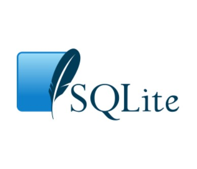
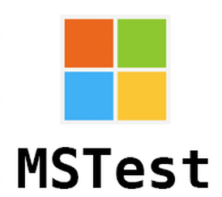

# Hi there 👋

I'm Maricar (MAH-ree-car/Mah-ree-CAR)/Kai.

Self-taught JavaScript, HTML, CSS, Bootstrap, Node.js, TypeScript for 6~ months using freeCodeCamp and YouTube tutorials, before joining LaunchCode's CoderGirl JavaScript & C# Web Development program where I also got familiar with Angular.

I am available for remote full-time employment mainly focused on C#/.NET and JavaScript Web Development.

📧 How to reach me: LinkedIn

✨ Pronouns: she/her

⚡ Random facts about me: I used to work as a flight attendant and an ESL instructor. I can read and write Korean characters, just don't ask me to translate them 😅

## My Tech Stack

 

## I’m currently learning

## I’m currently working on
 
- [Organizely E-Planner (March 1, 2021 - April 26, 2021)](https://github.com/AKA-Liftoff-Group-2021/Organizely-App): A dynamic web application, built with C#/.NET RESTful Web API for the back-end and Angular 11 for the front-end, using SQLite for the database, and JSON web tokens for authentication to help students manage time and organize tasks, designed with simple but practical features. This is a group capstone project I worked on with 3 other LaunchCode graduates. 
- [Recipe Manager (May 6, 2021 - Present)](https://github.com/mlwalters/MyRecipeCollection-cSharpMVC/tree/master) A full-stack recipe manager using C#/.NET5 MVC pattern, Bootstrap, and SQLServer for the database.
- [Movie Watchlist (February 23, 2021 - February 25, 2021)](https://github.com//mlwalters/MovieWatchlist) A full-stack movie watchlist web app using C#/.NET5 MVC pattern, Bootstrap, and SQLServer for the database. This will be continued and modified to be an application that will make it easier for couples, families, and friends to decide on what to watch by matching their lists and interests.

## My Projects
#### Full-stack/Back-End
- [TechJobs (Persistent edition)](https://github.com//mlwalters/TechJobsPersistent): A C#/.NET web app using MVC design pattern that can search and list(lookup) jobs with Bootstrap, using persistent database (MySQL) with authentication and CRUD functionality
- [Coding Events](https://github.com/mlwalters/codingEvents-authentication): A C#/.NET web app using MVC design pattern with EF Core, a persistent database (MySQL) with authentication and CRUD functionality, and the Identity package for authorization where you can add coding events with categories linked to each event
- [Payment Detail App](https://github.com/mlwalters/angular11dotnet5-paymentDetailApp): An Angular 11 web app that consumes a Web API built using C#/.NET5, Bootstrap, with SQLServer as database provider. I followed a tutorial for this to review Angular and learn to consume an API using HTTP requests, and mostly learn to build a web API as preparation for my capstone project (Organizely E-Planner).

#### Front-End 
- A LaunchCode Codergirl assignment, a webpage to demonstrate HTML/CSS skills [Live](https://mlwalters.github.io/html-me-something) | [Repo](https://github.com/mlwalters/html-me-something)
- A website with activities you can do during quarantine using HTML/CSS [Live](https://mlwalters.github.io/stay-at-home/) | [Repo](https://github.com//mlwalters/stay-at-home)
- A booklist app that also stores data to local storage using HTML/CSS/JavaScript [Live](https://mlwalters.github.io/booklist-app/) | [Repo](https://github.com//mlwalters/booklist-app)
- A to-do web app that stores data to local storage using HTML/CSS/JavaScript [Live](https://mlwalters.github.io/todo-webapp/) | [Repo](https://github.com//mlwalters/todo-webapp)
- freeCodeCamp sample portfolio [Live](https://mlwalters.github.io/freeCodeCamp-portfolio/) | [Repo](https://github.com//mlwalters/fcc-portfolio)

##### Some of my older front-end projects (when I first started coding)
- One of my first projects to demonstrate what I have learned with web design principles & responsiveness [Live](https://mlwalters.github.io/recipe-page/) | [Repo](https://github.com//mlwalters/recipe-page)
- A website for a made-up company [Codepen](https://codepen.io/carrimaxx/full/YzwGmGp)
- A sample technical documentation page [Codepen](https://codepen.io/carrimaxx/full/eYJBMKr)
- A sample survey form [Codepen](https://codepen.io/carrimaxx/full/dyYbyVd)

## Certificates
- [LaunchCode](https://www.launchcode.org/) Codergirl JavaScript & C# Web Development Course - 2020-2021
- [freeCodeCamp Responsive Web Design](https://www.freecodecamp.org/certification/carrimaxx/responsive-web-design) - 2020
- freeCodeCamp Algorithm and Data Structures - 2020 (3 challenges away from getting my certificate, temporarily discontinued to focus on LaunchCode's course)

Credits: icons from freepik/flaticon
